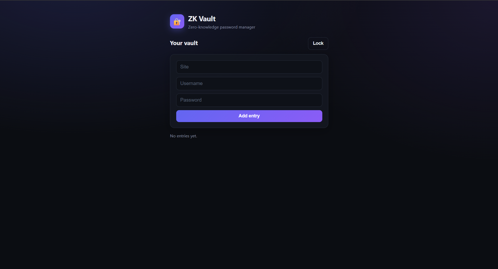
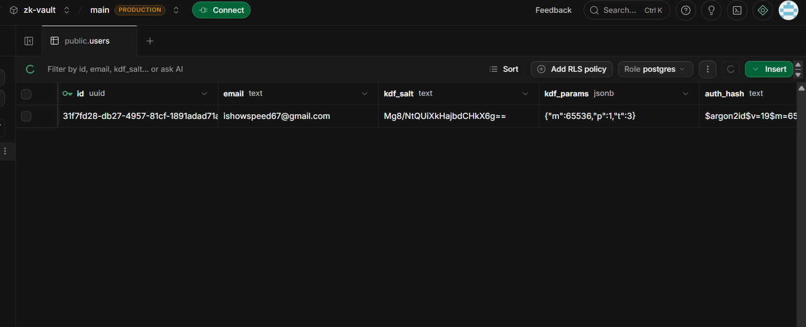

# ZK Vault

A zero-knowledge password manager. Everything is encrypted in the browser, so the server and database only ever store ciphertext.

**Live demo:** https://zk-vault-theta.vercel.app
(The API runs on a free tier and can take up to a minute to wake up on the first request. Please do not store real passwords in the demo.)




## How it works

- The master password and encryption key never leave the browser.
- Login proves knowledge of the master password through a separate derived auth key, which the server hashes again before storing.
- All entries, including site names, are encrypted with a random vault key. That key is wrapped by the master-derived key, so changing the master password only needs the vault key re-wrapped, not every entry re-encrypted.
- AES-GCM authenticates the data, so tampered ciphertext is rejected on decrypt.

## Tech stack

| Layer | Tools |
|---|---|
| Client | React, Vite, Web Crypto API, hash-wasm (Argon2id) |
| Server | Node.js, Express, zod, helmet, express-rate-limit, argon2, JWT |
| Database | Supabase Postgres (row level security on) |
| Hosting | Vercel (client), Render (API) |

## Security measures

- Argon2id key derivation, HKDF key separation, AES-256-GCM with a unique random IV per encryption
- Server stores only salt, KDF parameters, a hash of the auth key, the wrapped vault key and ciphertext
- Per-user data isolation enforced in every query
- Fake salt and dummy hash verification to limit account enumeration through /prelogin and login timing
- Input validation on every route, body size limit, security headers, parameterised SQL
- Rate limiting on auth routes, short-lived (15 min) tokens, keys held in memory only
- Clipboard cleared 20 seconds after copying a password

Full analysis: [docs/threat-model.md](docs/threat-model.md)

## Known limitations

- A malicious server could serve modified JavaScript. This is inherent to any web-delivered E2E app.
- No Content Security Policy yet, so XSS defence relies on React escaping
- No account recovery by design: a forgotten master password means the data is lost
- Password change, 2FA and session revocation are not implemented yet
- The server can see metadata such as email, entry count and timestamps

## Run locally

Requirements: Node 20+, a Postgres database (Supabase works).

```
git clone https://github.com/YOUR-USERNAME/zk-vault.git
cd zk-vault/server
npm install
cp .env.example .env     # then fill in the values
npm run dev

cd ../client
npm install
npm run dev
```

Server environment variables:

```
DATABASE_URL=postgres connection string
JWT_SECRET=long random string
CLIENT_ORIGIN=http://localhost:5173
PORT=4000
```

Client (optional): `VITE_API_URL=http://localhost:4000`

Database tables are in `docs/schema.sql`.

## Tests

```
cd client
npm test
```
Unit tests cover encrypt/decrypt round trips, wrong-key failure, tamper detection, IV uniqueness, key derivation, and vault key wrap/unwrap.
